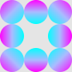

# 境界線

`border-image`プロパティを使用して、2つのパターンを作成してみました。

## グラデーション

### HTML

**グラデーション**を使用して表示させるためのh2要素です。

```html
<h2 class="gradation">グラデーション</h2>
```

### CSS

`border-image-source`プロパティには左辺から紫色、青みかかった灰色、水色の順番でグラデーションさせたボーダーを表示しています。

```css
h2.gradation {
    border-image-source: linear-gradient(90deg, #f0f, #abf, #0ff);
}
```

`border-image-slice`プロパティには省略記述で`1 1`（上下、左右）と指定して表示させています。

```css
h2.gradation {
    border-image-slice: 1 1;
}
```

`border-image-width`プロパティには幅が15pxの線を表示するように指定しています。

```css
h2.gradation {
    border-image-width: 15px;
}
```

### 一括指定

`border-image`プロパティは一括指定することができます。
```css
h2.gradation {
    border-image: linear-gradient(90deg, #f0f, #abf, #0ff) 1 1 / 15px;
}
```
<br>

## 画像

### HTML

**画像**を使用して表示させるためのh2要素です。

```html
<h2 class="image">画像</h2>
```

### CSS

`border-image-source`プロパティには以下の画像を使用しています。



```css
h2.image {
    border-image-source: url("images/circle.png");
}
```

`border-image-slice`プロパティは上下左右ともに30の値で画像（円の模様）をスライスせずに全体を表示させています。

```css
h2.image {
    border-image-slice: 30;
}
```

`border-image-width`プロパティには上下左右ともに幅を20pxで表示させています。

```css
h2.image {
    border-image-width: 20px;
}
```

`border-image-repeat`プロパティには省略記述で`round stretch`（上下、左右）と指定をして上辺と下辺は円の模様を繰り返し、左辺と右辺には真ん中の円の模様を1つだけ縦に引き延ばしたものを表示させています。

```css
h2.image {
    border-image-repeat: round stretch;
}
```

### 一括指定

`border-image`プロパティは一括指定することができます。

```css
h2.image {
    border-image: url("images/circle.png") 30 / 20px round stretch;
}
```
<br>

[完成ページへ](https://yscyber.github.io/border/ "https://yscyber.github.io/border/")
